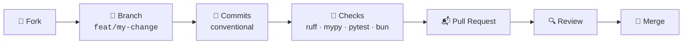

<div align="center">

# 🤝 Contributing to Ryliox

**First off — thank you!** Every bug report, feature, fix, doc improvement and translation makes Ryliox better for everyone.

[🌟 Ways to Contribute](#-ways-to-contribute) ·
[🛠️ Setup](#%EF%B8%8F-development-setup) ·
[🔀 Workflow](#-workflow) ·
[📝 Commits](#-commit-convention) ·
[✅ Standards](#-code-standards) ·
[📬 Pull Requests](#-pull-requests)

</div>

---

> [!NOTE]
> By participating you agree to follow our [Code of Conduct](CODE_OF_CONDUCT.md) and to license your contributions under the [MIT License](LICENSE).

## 🌟 Ways to Contribute

| | Contribution | How |
| :-: | --- | --- |
| 🐛 | **Report a bug** | [Open an issue](https://github.com/ZnOw01/Ryliox/issues) with repro steps (see below) |
| 💡 | **Suggest a feature** | Open an issue describing the use case, not just the solution |
| 📖 | **Improve docs** | Typos, clarity, examples — always welcome |
| 🌍 | **Translate the UI** | Add a locale under `frontend/src/i18n/` |
| 🧩 | **Write a plugin** | Extend the microkernel — see `plugins/base.py` |
| 🔧 | **Submit code** | Fork, branch, PR — the full flow is below |

## 🐛 Reporting Bugs

A great bug report includes:

1. **Environment** — OS, Python version (`python --version`), Bun version (`bun --version`), how you run Ryliox (launcher / Docker).
2. **Steps to reproduce** — numbered, minimal, deterministic if possible.
3. **Expected vs. actual behavior.**
4. **Logs** — relevant excerpts from `logs/` or the console, with **cookies and tokens redacted**.

> [!CAUTION]
> **Never paste cookies, JWTs, or tokens** (`orm-jwt`, `orm-rt`, …) into an issue — they grant access to your O'Reilly account.

## 🔐 Security Vulnerabilities

**Do not open a public issue for security problems.** Report them privately through [GitHub Security Advisories](https://github.com/ZnOw01/Ryliox/security/advisories/new). We will acknowledge, investigate, and coordinate disclosure with you.

## 🛠️ Development Setup

**Prerequisites**

| Tool | Version |
| --- | --- |
| 🐍 Python | 3.11 · 3.12 · 3.13 |
| 📦 uv | latest |
| 🥟 Bun | 1.3+ |
| 🟢 Node.js | 22.13+ or 24+ |
| 🖼️ GTK3 runtime | Windows only, for PDF export |

```bash
git clone https://github.com/ZnOw01/Ryliox.git
cd Ryliox
cp .env.example .env
python -m launcher   # automatic setup in .run/venv
```

> [!TIP]
> On Windows, if `uv` struggles with a broken `.venv`, use a clean ignored environment:
>
> ```powershell
> $env:UV_PROJECT_ENVIRONMENT=".run\dev-venv"
> uv sync --extra dev
> ```

## 🔀 Workflow



1. **Fork** the repository and clone your fork.
2. **Create a branch** from `main`:
   - `feat/short-description` — new features
   - `fix/short-description` — bug fixes
   - `docs/short-description` — documentation only
3. **Make your changes** in small, focused commits.
4. **Run all checks** (see below) — CI runs the same ones.
5. **Open the PR** against `main` and fill in the template.

## 📝 Commit Convention

We use [Conventional Commits](https://www.conventionalcommits.org/):

```text
<type>(<scope>): <subject>
```

| Type | Use for | Example |
| --- | --- | --- |
| `feat` | ✨ New features | `feat(queue): add retry policy for failed jobs` |
| `fix` | 🐛 Bug fixes | `fix(cookies): encrypt legacy rows on first startup` |
| `docs` | 📖 Documentation | `docs(readme): clarify GTK3 requirement` |
| `style` | 💅 Formatting only | `style: apply ruff format` |
| `refactor` | ♻️ Code change, no behavior change | `refactor(launcher): split into focused modules` |
| `perf` | ⚡ Performance | `perf(assets): cache cover images` |
| `test` | 🧪 Tests | `test(security): add rate-limit cases` |
| `build` | 📦 Build / deps | `build(deps): bump fastapi to 0.115` |
| `ci` | 👷 CI config | `ci: cache uv environment` |
| `chore` | 🧹 Maintenance | `chore: update .gitignore` |
| `revert` | ⏪ Reverts | `revert: feat(queue): add retry policy` |

**Rules:** subject in imperative mood, ≤ 72 characters, no trailing period; body explains the *why*, not the *what*.

## ✅ Code Standards

### 🐍 Python

| Rule | Value |
| --- | --- |
| Line length | 100 characters |
| Quotes | Double (`"`) |
| Indentation | 4 spaces |
| Type hints | Required for public functions |
| Naming | `snake_case` functions/vars · `PascalCase` classes · `UPPER_CASE` constants |
| Docstrings | Google style, for public APIs |

```python
def fetch_book(book_id: str) -> dict:
    """Fetch book metadata.

    Args:
        book_id: Unique book identifier.

    Returns:
        Book metadata dictionary.
    """
    return {}
```

Lint, format and type-check before pushing:

```bash
uv run ruff format --check .
uv run ruff check .
uv run mypy
```

### 🖥️ Frontend (TypeScript / Astro / React)

- Prettier for formatting, `tsc --noEmit` for types.
- Functional components and hooks; state through the existing stores (`zustand`) and server state through React Query.
- Keep components accessible (semantic HTML, labels, keyboard support) — we run a11y tests.

```bash
cd frontend
bun run typecheck
bun run format:check
bun run test
```

## 🧪 Testing

All tests must pass locally before opening a PR — CI runs exactly this matrix.

**Backend**

```bash
uv sync --frozen --extra dev
uv run ruff check .
uv run ruff format --check .
uv run mypy
uv run pytest
```

**Frontend**

```bash
cd frontend
bun install --frozen-lockfile
bun run typecheck
bun run test
bun run format:check
bun run build
```

**Security suite** (optional locally, encouraged for security-related changes)

```bash
uv sync --extra security
uv run pytest tests/security -q --run-security
```

Tests are organized with markers: `unit`, `integration`, `contract`, `security`, `e2e`, `a11y`, `performance`. Run a subset with `uv run pytest -m unit`.

**Writing new tests?** Match the existing structure under `tests/`, use the provided fixtures, and keep unit tests fast and network-free.

## 📬 Pull Requests

**Before opening:**

- [ ] 🌿 Branch is up to date with `main` (`git rebase origin/main`)
- [ ] 🧪 All backend and frontend checks pass
- [ ] 📝 Commits follow the convention
- [ ] 📖 Docs updated if behavior changed (`README.md`, `.env.example`, docstrings)
- [ ] 📋 `CHANGELOG.md` entry added under `[Unreleased]` for user-facing changes
- [ ] 🔐 No secrets, cookies, or tokens anywhere in the diff

**In the description:** explain *what* and *why*, link related issues (`Closes #123`), and add screenshots for UI changes.

**Review process:** a maintainer will review, may request changes, and merges when green. Small, focused PRs get reviewed fastest. 💨

## 📜 License

By contributing, you agree that your contributions are licensed under the [MIT License](LICENSE).

---

<div align="center">

**Thank you for helping make Ryliox better! 💜**

[⬆ Back to top](#-contributing-to-ryliox)

</div>
