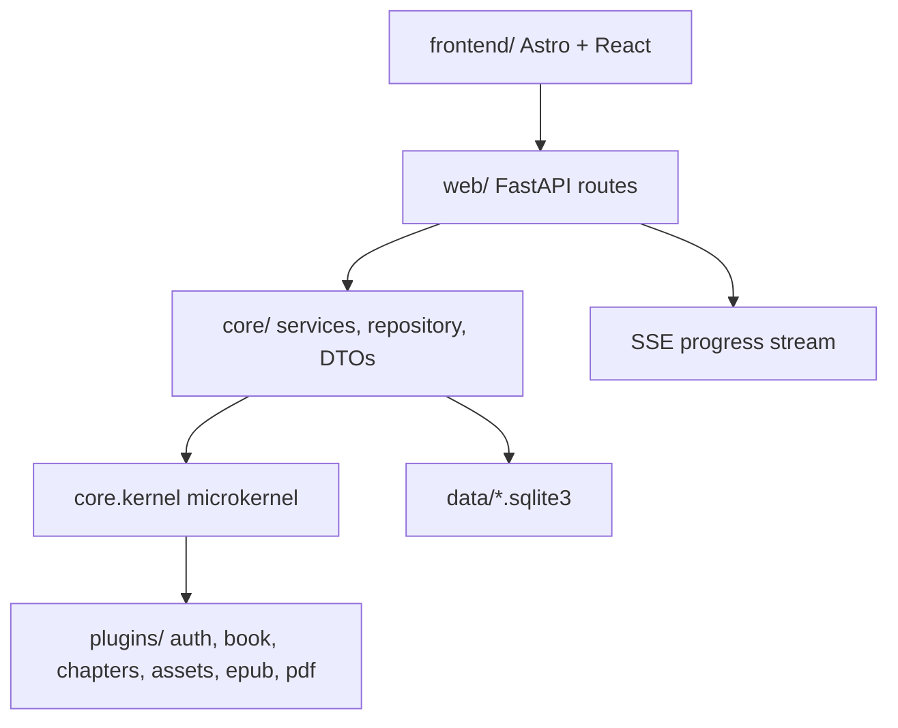

# Ryliox

[](https://www.python.org/)
[](https://fastapi.tiangolo.com/)
[](https://astro.build/)
[](LICENSE)

Export books from the O'Reilly Learning Platform to EPUB or PDF through a
single local web app. Ryliox combines a FastAPI backend, an Astro/React
frontend, a persistent download queue, live progress streaming, and local
session storage.

Ryliox is designed for personal and educational use. Read the
[Disclaimer](#disclaimer) before using it.

## Contents

- [What It Does](#what-it-does)
- [Quick Start](#quick-start)
- [Cookie Setup](#cookie-setup)
- [Development](#development)
- [Architecture](#architecture)
- [API Surface](#api-surface)
- [Configuration](#configuration)
- [Troubleshooting](#troubleshooting)
- [Project Layout](#project-layout)

## What It Does

- Exports books to **EPUB 3** and **PDF**.
- Uses the O'Reilly V2 API and the same cookie-based auth flow as the web
  reader.
- Queues downloads and streams live status with Server-Sent Events.
- Serves the Astro/React frontend from the same FastAPI origin.
- Stores cookies in SQLite, with legacy JSON migration.
- Includes OWASP-aware defaults: same-origin checks, security headers, request
  limits, rate limiting, audit logging, encrypted secret storage, typed config,
  and Prometheus metrics.

## Quick Start

### Docker

```bash
git clone https://github.com/ZnOw01/Ryliox.git
cd Ryliox
docker compose up -d
```

Open `http://localhost:8000`.

The Compose port is bound to `127.0.0.1` intentionally. Ryliox does not
authenticate clients of its own API, and the cookie-management endpoint can
return stored O'Reilly cookie values to the local UI. Do not expose port 8000
to a LAN or the public internet without an authenticating reverse proxy.

### Local

Requirements:

- Python 3.11, 3.12, or 3.13
- Bun 1.3+
- Node 22.12+ or Node 24+
- GTK3 runtime on Windows for WeasyPrint PDF export:
  [GTK for Windows][gtk]

```bash
git clone https://github.com/ZnOw01/Ryliox.git
cd Ryliox
uv sync --extra dev
python -m launcher --no-browser
```

Open `http://localhost:8000`.

The launcher creates an isolated Python environment in `.run/venv`, installs
frontend dependencies with Bun, builds the frontend when needed, and starts the
FastAPI app. Use `python -m launcher --docker` to run through Docker Compose.

[gtk]: https://github.com/tschoonj/GTK-for-Windows-Runtime-Environment-Installer/releases

## Cookie Setup

Ryliox needs your O'Reilly session cookies to access purchased or subscribed
content.

1. Open the web UI.
2. Click **Set cookies**.
3. Paste a full JSON cookie export from a browser extension such as
   EditThisCookie.

The full browser export is recommended because it can include the HttpOnly
`orm-rt` refresh cookie. Console snippets based on `document.cookie` cannot
read HttpOnly cookies, so sessions created that way may expire quickly.

Cookie storage is SQLite-first:

- The UI writes cookies to `data/session.sqlite3` through `POST /api/cookies`.
- `GET /api/cookies` reads from the same SQLite store.
- `data/cookies.json` is only a legacy import path.
- Once SQLite has cookies, editing `data/cookies.json` will not override them.

`data/session.sqlite3` is not encrypted. Protect the local account, filesystem,
backups, and Docker volume that contain it. Deleting cookies from the UI or the
database does not revoke an O'Reilly session already copied elsewhere.

## Development

Install Python dependencies:

```bash
uv sync --extra dev
```

Backend checks:

```bash
uv run ruff format --check .
uv run ruff check .
uv run mypy
uv run pytest
```

Frontend checks:

```bash
cd frontend
bun run typecheck
bun run test
bun run format:check
bun run build
```

Security checks:

```bash
uv sync --extra security
uv run pytest tests/security -q --run-security
```

If `uv run` tries to reuse a broken `.venv` on Windows, point uv at a clean
ignored environment:

```powershell
$env:UV_PROJECT_ENVIRONMENT=".run\dev-venv"
uv sync --extra dev
```

## Architecture



Runtime flow:

1. The user saves cookies through the UI or API.
2. The frontend searches books and requests metadata through `/api/*`.
3. `POST /api/download` validates the request and enqueues a job.
4. `DownloadQueueService` persists the job in SQLite.
5. A worker runs `DownloaderPlugin`, which fetches chapters, assets, and output
   formats.
6. Progress is persisted and streamed through `/api/progress/stream`.

## API Surface

| Method | Path | Purpose |
| --- | --- | --- |
| `GET` | `/api/status` | Auth and cookie status |
| `GET` | `/api/search?q=` | Search books |
| `GET` | `/api/book/{id}` | Book metadata |
| `GET` | `/api/book/{id}/chapters` | Chapter list |
| `POST` | `/api/download` | Queue a download |
| `GET` | `/api/progress?job_id=` | Job progress snapshot |
| `GET` | `/api/progress/stream` | Live progress stream |
| `POST` | `/api/cancel` | Cancel a job |
| `POST` | `/api/cookies` | Save session cookies |
| `GET` | `/api/health` | Liveness probe |
| `GET` | `/api/health/detailed` | Disk, memory, SQLite, external APIs |
| `GET` | `/metrics` | Prometheus metrics |
| `GET` | `/api/docs` | Swagger UI in development |

## Configuration

Configuration is loaded from `.env` into a typed Pydantic settings model.
Start from `.env.example`.

| Area | Examples | Notes |
| --- | --- | --- |
| Server | `HOST`, `PORT`, `APP_VERSION` | Bind address and app metadata |
| HTTP | `REQUEST_*`, `USER_AGENT`, `ACCEPT_*` | Outbound client behavior |
| Security | `ENVIRONMENT`, `CSP_POLICY`, `ALLOWED_HOSTS` | Headers, host checks, CSP |
| Rate limit | `RATE_LIMIT_*`, `API_RATE_LIMIT_*` | Endpoint throttling |
| Secrets | `SECRET_MASTER_PASSWORD` | Encryption and rotation |
| Audit | `AUDIT_*` | Audit log retention and integrity |
| Cache | `CACHE_*` | Resource cache sizes and TTLs |

Runtime paths default to local ignored directories:

- `data/` for SQLite, cookies, audit logs, and secrets
- `output/` for generated EPUB/PDF files
- `.run/` for launcher-managed local runtime files

## Troubleshooting

**`bun test --run` fails with Vitest errors**

Use `bun run test`. The test script runs `vitest run` with the configured JSDOM
environment.

**`uv run` fails on `.venv/lib64` with access denied**

The local `.venv` is likely incomplete or has a Windows symlink permission
problem. Use an ignored project environment:

```powershell
$env:UV_PROJECT_ENVIRONMENT=".run\dev-venv"
uv sync --extra dev
```

**PDF export fails on Windows**

Install the GTK3 runtime linked in [Quick Start](#quick-start). WeasyPrint needs
native libraries to render PDFs.

**Cookies save but auth expires quickly**

Use a full browser cookie JSON export. Console-based cookie snippets cannot read
the HttpOnly `orm-rt` refresh cookie.

## Project Layout

```text
config.py          Typed settings and legacy module-level constants
main.py            Thin server entry point
launcher/          Local workflow launcher
web/               FastAPI app, middleware, schemas, routes
core/              Services, repository, DTOs, kernel, security, storage
plugins/           Auth, book, chapter, asset, EPUB, PDF, downloader plugins
utils/             File and filename helpers
frontend/          Astro 7 + React 19 frontend
tests/             Unit, integration, contract, security, e2e, a11y, performance
```

## Credits

Ryliox is a from-scratch refactor inspired by
[Mosaibah/oreilly-ingest](https://github.com/Mosaibah/oreilly-ingest) and
[lorenzodifuccia/safaribooks](https://github.com/lorenzodifuccia/safaribooks).

## License

MIT. See [LICENSE](LICENSE).

## Disclaimer

Ryliox is for personal and educational use only. By using it, you agree to the
[O'Reilly Terms of Service](https://www.oreilly.com/terms/). The authors are not
affiliated with O'Reilly Media and assume no liability for how the tool is used.
