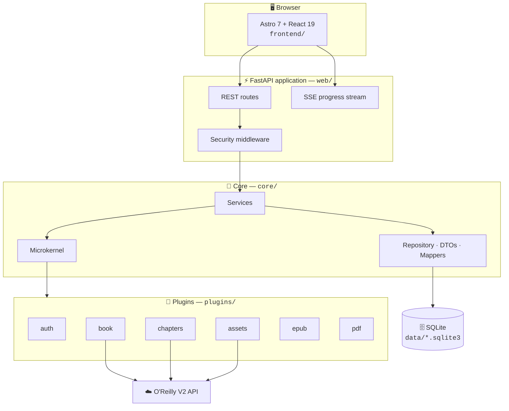
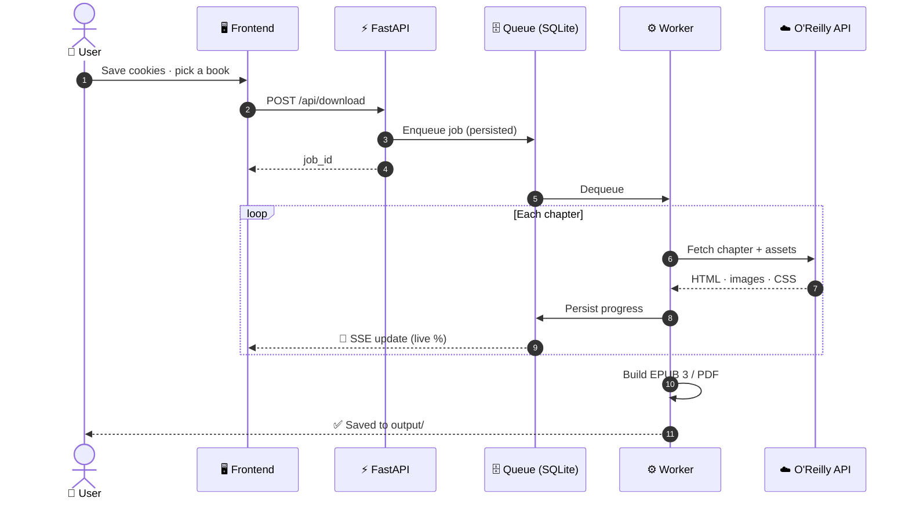

<div align="center">

# 📚 Ryliox

**Your O'Reilly Learning library, yours to keep.**
**Export any book to EPUB 3 or PDF from a single, beautiful local web app.**

[](https://github.com/ZnOw01/Ryliox/actions/workflows/ci.yml)
[](https://github.com/ZnOw01/Ryliox/blob/main/CHANGELOG.md)
[](https://www.python.org/)
[](https://fastapi.tiangolo.com/)
[](https://astro.build/)
[](https://bun.sh/)
[](https://docs.astral.sh/ruff/)
[](LICENSE)

[✨ Features](#-features) ·
[🚀 Quick Start](#-quick-start) ·
[🏗️ Architecture](#%EF%B8%8F-architecture) ·
[⚙️ Configuration](#%EF%B8%8F-configuration) ·
[🤝 Contributing](CONTRIBUTING.md) ·
[📋 Changelog](CHANGELOG.md)

</div>

---

> [!CAUTION]
> **Disclaimer — read before use.** Ryliox is for **personal and educational use only**. By using it, you agree to the [O'Reilly Terms of Service](https://www.oreilly.com/terms/). The authors are **not affiliated with O'Reilly Media** and assume no liability for how the tool is used. Only export content you have legal access to.

## ✨ Features

| | Feature | What you get |
| :-: | --- | --- |
| 📖 | **EPUB 3 export** | Clean, reflowable e-books built with EbookLib |
| 📄 | **PDF export** | Print-quality rendering via WeasyPrint |
| 🔄 | **Persistent download queue** | Jobs survive restarts — persisted in SQLite |
| 📡 | **Live progress** | Real-time status streamed with Server-Sent Events |
| 🍪 | **Session vault** | Cookie-based auth, SQLite-first storage with Fernet encryption |
| 🧩 | **Microkernel architecture** | Auth, book, chapters, assets, EPUB and PDF as hot-pluggable plugins |
| 🛡️ | **OWASP-aware defaults** | Same-origin checks, security headers, CSP, rate limiting, audit logging with HMAC |
| 📊 | **Observability** | Prometheus metrics, health probes, typed Pydantic configuration |
| 🌍 | **Internationalized UI** | i18next-powered Astro 7 + React 19 + Tailwind CSS 4 frontend |
| 🐳 | **One-command Docker** | `docker compose up -d` and you're done |
| 🧪 | **Full test matrix** | Unit, integration, contract, security, e2e, a11y and performance suites |

## 🚀 Quick Start

### 🐳 Docker (recommended)

```bash
git clone https://github.com/ZnOw01/Ryliox.git
cd Ryliox
docker compose up -d
```

Then open **<http://localhost:8000>**.

> [!WARNING]
> The Compose port is bound to `127.0.0.1` **intentionally**. Ryliox does not authenticate clients of its own API, and the cookie endpoint can return stored O'Reilly cookie values to the local UI. **Never expose port 8000** to a LAN or the public internet without an authenticating reverse proxy — see [🔒 Secure Deployment](#-secure-deployment).

### 💻 Local

**Requirements**

| Tool | Version | Notes |
| --- | --- | --- |
| 🐍 Python | 3.11 · 3.12 · 3.13 | Managed with [uv](https://docs.astral.sh/uv/) |
| 🥟 Bun | 1.3+ | Frontend toolchain |
| 🟢 Node.js | 22.13+ or 24+ | Required by Bun/Astro tooling |
| 🖼️ GTK3 runtime | Windows only | Needed by WeasyPrint for PDF export — [GTK for Windows][gtk] |

```bash
git clone https://github.com/ZnOw01/Ryliox.git
cd Ryliox
uv sync --extra dev
python -m launcher --no-browser
```

Then open **<http://localhost:8000>**.

The launcher creates an isolated Python environment in `.run/venv`, installs frontend dependencies with Bun, builds the frontend when needed, and starts the FastAPI app. Use `python -m launcher --docker` to run through Docker Compose instead.

[gtk]: https://github.com/tschoonj/GTK-for-Windows-Runtime-Environment-Installer/releases

## 🍪 Cookie Setup

Ryliox needs your O'Reilly session cookies to access purchased or subscribed content.

1. 🖥️ Open the web UI.
2. 🔧 Click **Set cookies**.
3. 📋 Paste a full JSON cookie export from a browser extension such as **EditThisCookie**.

> [!IMPORTANT]
> Use a **full browser export**, not a console snippet. Only the export can include the HttpOnly `orm-rt` refresh cookie — `document.cookie` cannot read HttpOnly cookies, so sessions created that way **expire quickly**.

**Cookie storage is SQLite-first:**

- The UI writes cookies to `data/session.sqlite3` through `POST /api/cookies`.
- `GET /api/cookies` reads from the same SQLite store.
- `data/cookies.json` is only a legacy import path — once SQLite has cookies, editing it has **no effect**.

> [!WARNING]
> Protect the local account, filesystem, backups and Docker volume that contain `data/session.sqlite3`. Deleting cookies from the UI or the database does **not** revoke an O'Reilly session already copied elsewhere.

## 🏗️ Architecture



**A download, step by step:**



**Runtime flow, in words:**

1. The user saves cookies through the UI or API.
2. The frontend searches books and requests metadata through `/api/*`.
3. `POST /api/download` validates the request and enqueues a job.
4. `DownloadQueueService` persists the job in SQLite.
5. A worker runs `DownloaderPlugin`, which fetches chapters, assets and output formats.
6. Progress is persisted and streamed through `/api/progress/stream`.

## 🌐 API Surface

| Method | Path | Purpose |
| --- | --- | --- |
| `GET` | `/api/status` | 🔐 Auth and cookie status |
| `GET` | `/api/search?q=` | 🔎 Search books |
| `GET` | `/api/book/{id}` | 📕 Book metadata |
| `GET` | `/api/book/{id}/chapters` | 📑 Chapter list |
| `POST` | `/api/download` | ⬇️ Queue a download |
| `GET` | `/api/progress?job_id=` | 📈 Job progress snapshot |
| `GET` | `/api/progress/stream` | 📡 Live progress stream |
| `POST` | `/api/cancel` | ⛔ Cancel a job |
| `POST` | `/api/cookies` | 🍪 Save session cookies |
| `GET` | `/api/health` | 💓 Liveness probe |
| `GET` | `/api/health/detailed` | 🩺 Disk, memory, SQLite, external APIs |
| `GET` | `/metrics` | 📊 Prometheus metrics |
| `GET` | `/api/docs` | 📖 Swagger UI (development) |

## ⚙️ Configuration

Configuration is loaded from `.env` into a **typed Pydantic settings model**. Start from the fully commented [`.env.example`](.env.example).

| Area | Examples | Notes |
| --- | --- | --- |
| 🖥️ Server | `HOST`, `PORT`, `APP_VERSION` | Bind address and app metadata |
| 🌐 HTTP | `REQUEST_*`, `USER_AGENT`, `ACCEPT_*` | Outbound client behavior |
| 🛡️ Security | `ENVIRONMENT`, `CSP_POLICY`, `ALLOWED_HOSTS` | Headers, host checks, CSP |
| 🚦 Rate limit | `RATE_LIMIT_*`, `API_RATE_LIMIT_*` | Endpoint throttling |
| 🔑 Secrets | `SECRET_MASTER_PASSWORD` | Encryption and rotation |
| 🧾 Audit | `AUDIT_*` | Audit log retention and integrity |
| ⚡ Cache | `CACHE_*` | Resource cache sizes and TTLs |

Runtime paths default to local, git-ignored directories:

| Path | Contents |
| --- | --- |
| `data/` | SQLite databases, cookies, audit logs, secrets |
| `output/` | Generated EPUB / PDF files |
| `.run/` | Launcher-managed local runtime files |

## 🔒 Secure Deployment

Localhost keeps the zero-configuration workflow. **A non-loopback bind — and every production deployment — requires:**

| Variable | Requirement |
| --- | --- |
| `RYLIOX_SECURITY__ADMIN_TOKEN` | At least 32 characters. Remote clients send it as `Authorization: Bearer <token>`; it is never compiled into the frontend bundle |
| `RYLIOX_SESSION__ENCRYPTION_KEY` | Fernet key (or `RYLIOX_SESSION__ENCRYPTION_KEY_FILE`) |
| `RYLIOX_AUDIT__HMAC_KEY` | Audit-log integrity key (or its `_FILE` variant) |
| `RYLIOX_SESSION__OLD_ENCRYPTION_KEYS` | Optional JSON list of old cookie keys while rotating |

**Migrations & filesystem safety**

- On first startup, plaintext cookie rows and legacy cookie files are imported, **encrypted transactionally**, and the plaintext source is removed. 💾 **Back up before upgrading.**
- Development keys are stored with mode `0600` in the platform user configuration directory, separate from SQLite and audit ciphertext.
- Output paths — including values selected by the local native picker — must remain below `RYLIOX_PATHS__OUTPUT_ROOT` (default `./output`). The native picker is **disabled for remote binds**.

## 🛠️ Development

```bash
uv sync --extra dev   # install Python dependencies
```

**Backend checks**

```bash
uv run ruff format --check .
uv run ruff check .
uv run mypy
uv run pytest
```

**Frontend checks**

```bash
cd frontend
bun run typecheck
bun run test
bun run format:check
bun run build
```

**Security checks**

```bash
uv sync --extra security
uv run pytest tests/security -q --run-security
```

> [!TIP]
> If `uv run` tries to reuse a broken `.venv` on Windows, point uv at a clean ignored environment:
>
> ```powershell
> $env:UV_PROJECT_ENVIRONMENT=".run\dev-venv"
> uv sync --extra dev
> ```

## 🧯 Troubleshooting

<details>
<summary><b>❌ <code>bun test --run</code> fails with Vitest errors</b></summary>

Use `bun run test`. The test script runs `vitest run` with the configured JSDOM environment.

</details>

<details>
<summary><b>❌ <code>uv run</code> fails on <code>.venv/lib64</code> with access denied</b></summary>

The local `.venv` is likely incomplete or has a Windows symlink permission problem. Use an ignored project environment:

```powershell
$env:UV_PROJECT_ENVIRONMENT=".run\dev-venv"
uv sync --extra dev
```

</details>

<details>
<summary><b>❌ PDF export fails on Windows</b></summary>

Install the GTK3 runtime linked in [Quick Start](#-quick-start). WeasyPrint needs native libraries to render PDFs.

</details>

<details>
<summary><b>❌ Cookies save but auth expires quickly</b></summary>

Use a full browser cookie JSON export. Console-based cookie snippets cannot read the HttpOnly `orm-rt` refresh cookie — see [🍪 Cookie Setup](#-cookie-setup).

</details>

## 🗂️ Project Structure

```text
Ryliox/
├── 🧠 config.py            Typed settings and legacy module-level constants
├── 🚪 main.py              Thin server entry point
├── 🚀 launcher/            Local workflow launcher (venv, frontend, Docker)
├── ⚡ web/                 FastAPI app, middleware, schemas, routes
├── 🧩 core/                Services, repository, DTOs, kernel, security, storage
├── 🔌 plugins/             Auth, book, chapter, asset, EPUB, PDF, downloader
├── 🔧 utils/               File and filename helpers
├── 🖥️ frontend/            Astro 7 + React 19 + Tailwind CSS 4
├── 🧪 tests/               Unit · integration · contract · security · e2e · a11y · performance
├── 🐳 Dockerfile           Multi-stage production image
├── 🐙 docker-compose.yml   Local orchestration (loopback-only)
└── 📊 epubcheck/           EPUB validation assets
```

## 🗺️ Roadmap

- [x] 🔄 Unified FastAPI backend with persistent SQLite queue
- [x] 🖥️ Astro 7 + React 19 frontend with i18n
- [x] 🔐 Encrypted session storage and audit logging
- [ ] 🖥️ Standalone CLI mode
- [ ] 📦 Prebuilt Docker image published to GHCR
- [ ] ✅ EPUB validation in CI (epubcheck)
- [ ] 🌐 More UI languages

## 🤝 Contributing

Contributions of all kinds are welcome — bug reports, features, docs and translations. Read the [📖 Contributing Guide](CONTRIBUTING.md) and follow the [🤲 Code of Conduct](CODE_OF_CONDUCT.md).

```bash
# The short version
git checkout -b feat/my-change
uv run ruff check . && uv run mypy && uv run pytest
# open a PR 🎉
```

## 🙏 Credits

Ryliox is a from-scratch refactor inspired by:

- [Mosaibah/oreilly-ingest](https://github.com/Mosaibah/oreilly-ingest)
- [lorenzodifuccia/safaribooks](https://github.com/lorenzodifuccia/safaribooks)

## 📜 License

Distributed under the **MIT License** — see [LICENSE](LICENSE).

---

<div align="center">

**If Ryliox helps you, consider giving it a ⭐ — it helps others find it!**

[⬆ Back to top](#-ryliox)

</div>
